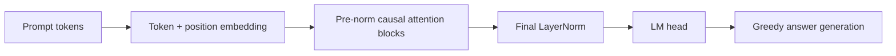

# CarryBench: Audited JAX vs PyTorch Transformer Benchmark

[](https://github.com/vishalvinjamuri27/CarryBench/actions/workflows/tests.yml)
[](https://colab.research.google.com/github/vishalvinjamuri27/CarryBench/blob/main/colab_run.ipynb)
[](LICENSE)

CarryBench is a controlled ML-systems study of matched decoder-only transformers implemented directly in JAX/Flax/Optax and PyTorch. Fixed-width addition provides deterministic data, short iteration cycles, interpretable failure modes, and an exact task-level metric.

The project tests two separate questions:

1. How do JAX and PyTorch runtime choices affect compile cost, training throughput, latency, and memory?
2. How do loss masking and carry-aligned answer order affect free-running algorithmic generalization?

## Phase 2 Results Pending

The original public-release numbers were based on teacher-forced answer-token predictions. That metric lets later answer positions observe earlier ground-truth answer digits, so it is not sufficient evidence that the model independently generates the correct sum.

Version `0.2.0` promotes **free-running generated exact match** to the primary metric and retires the old headline table. Final A100 results will be published after the updated Colab suite is rerun. Teacher-forced accuracy remains available as a diagnostic and is labeled explicitly.

This is intentional scientific versioning: claims are withheld until the corrected experiment produces auditable raw artifacts.

### Phase 2 result-table preview — placeholders only

The final report will use the schemas below. Every `TBD` entry is a placeholder, **not a measured result or performance claim**.

Quality results will report free-running accuracy on the disjoint test set:

| Experiment | JAX generated exact match | PyTorch generated exact match | Seeds |
|---|---:|---:|---:|
| 5-digit full-sequence LM | `TBD mean ± std` | `TBD mean ± std` | `TBD` |
| 6-digit full-sequence LM | `TBD mean ± std` | `TBD mean ± std` | `TBD` |
| 5-digit answer-only | `TBD mean ± std` | `TBD mean ± std` | `TBD` |
| 6-digit answer-only | `TBD mean ± std` | `TBD mean ± std` | `TBD` |
| 5-digit reversed answer | `TBD mean ± std` | `TBD mean ± std` | `TBD` |
| 6-digit reversed answer | `TBD mean ± std` | `TBD mean ± std` | `TBD` |

Runtime results will distinguish compilation strategy and precision:

| Backend | Precision | First step | Median ms/step | p95 ms/step | Tokens/sec | Peak memory |
|---|---|---:|---:|---:|---:|---:|
| JAX JIT | FP32 | `TBD` | `TBD` | `TBD` | `TBD` | `TBD` |
| JAX JIT | BF16 | `TBD` | `TBD` | `TBD` | `TBD` | `TBD` |
| PyTorch eager/manual attention | FP32 | `TBD` | `TBD` | `TBD` | `TBD` | `TBD` |
| PyTorch eager/SDPA | FP32 | `TBD` | `TBD` | `TBD` | `TBD` | `TBD` |
| PyTorch compiled/SDPA | FP32 | `TBD` | `TBD` | `TBD` | `TBD` | `TBD` |
| PyTorch compiled/SDPA | BF16 | `TBD` | `TBD` | `TBD` | `TBD` | `TBD` |

KV-cache results will report warmed prefill latency, decode latency, total latency, and decode throughput for every `(batch size, generated length)` pair. Phase 2 will replace these tables only from the committed raw JSON and generated aggregate CSV files.

## What Is Implemented

- Matched decoder-only transformer implementations without Hugging Face dependencies.
- Exact GELU and matched LayerNorm epsilon across frameworks.
- Deterministic, disjoint train/validation/test partitions.
- Free-running greedy exact match for JAX and PyTorch.
- Teacher-forced accuracy retained under an explicit diagnostic name.
- Full-sequence, answer-only, and reversed-answer ablations.
- JAX JIT training and PyTorch eager, SDPA, and `torch.compile` baselines.
- Synchronized timing distributions: mean, median, p95, and standard deviation.
- Manual JAX KV-cache decoding validated against naive decoding.
- KV-cache sweeps over batch size and generated length.
- Carry-heavy diagnostic sets and curriculum evaluation slices.
- Raw JSON, CSV, Markdown, environment, Git revision, and plot generation.
- CPU unit tests, smoke training, linting, formatting, and multi-version CI.

## Primary Metrics

| Metric | Purpose |
|---|---|
| Generated exact match | Primary quality metric; greedily decodes the entire answer from the prompt |
| Teacher-forced exact match | Diagnostic next-token metric; not treated as task success |
| Carry-heavy generated exact match | Stress test for long carry behavior |
| Steady train-step time | Synchronized post-warm-up forward/backward/update latency |
| Tokens/sec | Training throughput for the measured batch and sequence shape |
| First-step time | Compile or framework warm-up cost |
| Median/p95/std | Timing stability rather than a single average |
| KV decode tokens/sec | Naive and cached autoregressive decode throughput |

Time-to-90% and time-to-99% summaries also use generated exact match.

## Experimental Controls

- A stable 64-bit hash assigns train/eval/test pairs to disjoint 80/10/10 partitions without creating contiguous operand bands.
- JAX and PyTorch receive the same examples, batch order, architecture shape, optimizer family, learning rate, and step budget.
- Evaluation retains partial final batches and weights metrics by example count.
- PyTorch host transfers and reporting metrics occur outside the timed train-step region.
- Runtime results record Python, framework, platform, and Git-commit metadata.
- JAX/XLA versus PyTorch eager is never treated as the only framework comparison; SDPA and compiled PyTorch results are generated alongside it.

See [Benchmark Protocol](docs/BENCHMARK_PROTOCOL.md) and [Limitations](docs/LIMITATIONS.md).

## Architecture

Both implementations use token and learned positional embeddings, pre-norm causal self-attention blocks, exact GELU MLPs, a final LayerNorm, and an untied language-model head.



For `n`-digit operands, examples use a fixed `n + 1` digit answer:

```text
<bos>007+008=0015<eos>
```

The reversed-answer ablation emits least-significant digits first so generation follows carry propagation:

```text
12345+67890=532080
```

Here `532080` is the reverse of the normal fixed-width answer `080235`.

## Local Setup

```bash
git clone https://github.com/vishalvinjamuri27/CarryBench.git
cd CarryBench
python3 -m venv .venv
source .venv/bin/activate
pip install -r requirements.txt
```

For the exact locally verified CPU package set:

```bash
pip install -r requirements-lock-cpu.txt
```

Run tests and smoke training:

```bash
python -m unittest discover -s tests
ruff check src tests
ruff format --check src tests
./scripts/run_smoke.sh
```

## Reproduce the GPU Study

Open [colab_run.ipynb](colab_run.ipynb), select a CUDA GPU, verify that both frameworks detect it, and run all cells. The main command is:

```bash
./scripts/run_final_experiments.sh
```

It runs the multi-seed quality suite plus these runtime variants:

- JAX JIT.
- PyTorch handwritten eager attention.
- PyTorch eager SDPA.
- PyTorch compiled SDPA.
- JAX naive and KV-cached decoding across multiple batch and decode lengths.

The default remains three seeds for Colab cost. For stronger accuracy estimates, run at least five:

```bash
SEEDS="0 1 2 3 4" ./scripts/run_final_experiments.sh
```

Then create the reviewable release bundle:

```bash
./scripts/export_release_artifacts.sh
```

Generated files include raw JSON, per-run tables, aggregate means and standard deviations, bootstrap intervals for generated accuracy, environment metadata, and SVG/PNG plots. Release-ready files are copied to `artifacts/final/`; checkpoints remain ignored.

The Colab notebook also creates `results_bundle.zip`. Download that archive and provide it for the Phase 2 audit; it contains both `results/` and `artifacts/`.

## Repository Layout

```text
artifacts/final/          Committable final tables, raw JSON, and plots
configs/                  Experiment definitions
docs/                     Protocol and limitations
scripts/                  Smoke, final-suite, and artifact-export runners
src/
  data.py                 Disjoint synthetic datasets and diagnostic slices
  flax_model.py           JAX/Flax transformer
  torch_model.py          PyTorch transformer with manual/SDPA attention
  train_jax.py            Jitted training and generated evaluation
  train_torch.py          Eager/compiled training and generated evaluation
  kv_cache_jax.py         Manual JAX KV-cache inference
  benchmark.py            Runtime and decode benchmark CLI
  summarize_results.py    Per-run and aggregate result summaries
  plot_results.py         Accuracy and KV-cache plots
tests/                    Unit, integration, split, generation, and SDPA tests
colab_run.ipynb           GPU experiment runner and artifact bundler
```

## Current Verification

Phase 1 was verified locally on CPU with:

- 35 passing tests.
- JAX smoke training end to end.
- PyTorch smoke training end to end.
- JAX naive/KV-cache output equivalence.
- PyTorch manual-attention/SDPA numerical equivalence.
- Ruff lint and format checks.

GPU results are deliberately not claimed until the Phase 2 artifacts are produced.

## License

MIT. See [LICENSE](LICENSE).
