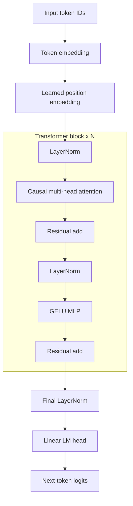

# CarryBench: JAX vs PyTorch Transformer Runtime Benchmark

[](https://colab.research.google.com/github/vishalvinjamuri27/CarryBench/blob/main/colab_run.ipynb)

This is a controlled benchmark comparing a decoder-only transformer in **JAX/Flax/Optax** against a matched **PyTorch** baseline on the task of fixed-width algorithmic addition. The goal is not to prove that transformers can do addition; addition is used as a compact task for studying framework/runtime behavior.

## Highlights

- Matched JAX/Flax and PyTorch decoder-only transformer implementations.
- Reproducible synthetic addition datasets with fixed sequence lengths.
- Multi-seed A100 GPU experiments for 5- and 6-digit addition.
- Answer-only and reversed-answer ablations to isolate why addition is hard for causal LMs.
- JAX naive decoding vs manual KV-cache decoding benchmark.
- One-command experiment runner and CSV/Markdown result summaries.

## Main Result

The strongest task formulation is **6-digit addition with answer-only loss and reversed answer digits**. The arithmetic problem is the same, but the answer digits are rendered right-to-left so autoregressive generation follows carry propagation.

Reported on an **NVIDIA A100 GPU**, seeds `0, 1, 2`:

| Experiment | JAX exact match | PyTorch exact match |
|---|---:|---:|
| 5-digit full-sequence LM | `0.494 +/- 0.461` | `0.009 +/- 0.007` |
| 6-digit full-sequence LM | `0.064 +/- 0.108` | `0.000 +/- 0.000` |
| 5-digit answer-only | `0.962 +/- 0.019` | `0.920 +/- 0.035` |
| 6-digit answer-only | `0.904 +/- 0.036` | `0.320 +/- 0.542` |
| 6-digit answer-only, 3000 steps | `0.932` | `0.996` |
| 5-digit reversed answer | `1.000 +/- 0.000` | `1.000 +/- 0.000` |
| 6-digit reversed answer | `1.000 +/- 0.000` | `1.000 +/- 0.000` |

The takeaway is that full-sequence LM loss is a poor formulation for longer addition because it spends loss on random prompt digits. Answer-only loss makes the task significantly more learnable, especially for JAX at 1000 steps. Reversing the answer digits aligns generation with carry propagation, making 5- and 6-digit addition solve cleanly.

Runtime on the standard 3-digit benchmark:

| Backend | First step | Steady ms/step | Tokens/sec | Exact match |
|---|---:|---:|---:|---:|
| JAX/Flax | `19.61s` | `7.72` | `431k` | `1.000` |
| PyTorch eager | `0.44s` | `18.80` | `177k` | `1.000` |

JAX/XLA has a large one-time compile cost, but then runs about **2.4x faster** than PyTorch eager mode during steady-state training for this workload.

## Architecture

Both backends implement the same GPT-style decoder-only transformer: token embeddings, learned positional embeddings, pre-norm causal self-attention blocks, GELU MLPs, final LayerNorm, and an untied LM head.



## Task

Each example is a fixed-width character sequence:

```text
<bos> aaa+bbb=cccc <eos>
```

Examples:

```text
007+008=0015
123+456=0579
999+999=1998
```

For `n`-digit operands, the answer width is `n + 1`. The exact-match accuracy is computed over the answer span, because one wrong digit makes the arithmetic answer wrong.

The reversed-answer ablation configures the output digits right-to-left:

```text
12345+67890=532080
```

The normal answer is `080235` but the model is trained to return `532080`.

## Local Setup

```bash
git clone https://github.com/vishalvinjamuri27/CarryBench.git
cd CarryBench

python3 -m venv .venv
source .venv/bin/activate
pip install -r requirements.txt
```

Run local tests and smoke checks:

```bash
python -m unittest discover -s tests
./scripts/run_smoke.sh
```

## Reproduce The Main Experiment

The notebook is the easiest way to reproduce the full experiment:

- [`colab_run.ipynb`](colab_run.ipynb)

Use a CUDA GPU runtime, then run:

```bash
!./scripts/run_final_experiments.sh
```

This runs the 5- and 6-digit experiments across 3 seeds (`0, 1, 2`), the answer-only and reversed-answer ablations, the long 6-digit answer-only check, and the runtime/KV-cache benchmarks.

Results are written to `results/*.json` and summarized into `summary_table.csv`, `summary_table.md`, `summary_aggregate.csv`, and `summary_aggregate.md`.

## JAX JIT vs PyTorch Eager

- JAX/Flax uses an XLA JIT-compiled training step.
- The primary PyTorch baseline uses eager execution.
- `first_step_time_sec` includes JAX compilation cost.
- `steady_state_step_time_ms` measures repeated post-warmup training throughput.

This speedup should be read specifically as a comparison between JAX/XLA-compiled training and PyTorch eager execution for this model, task, and A100 GPU. The PyTorch trainer includes a `--compile` option, but the main results use eager mode because it is the more reliable baseline across notebook runtimes.

## JAX KV-Cache Decode

On the short 3-digit benchmark the manual JAX KV-cache decoding improves warmed batch-32 decode throughput from `23.8k` to `35.5k` generated tokens/sec, about **1.5x**. The sequence is short so this is a conservative KV-cache case. Longer generated sequences should benefit more.

## Technologies

JAX, Flax, Optax, PyTorch, NumPy, YAML, Jupyter/Colab, and GitHub Actions.

## Repository Layout

```text
configs/                 Experiment configs
scripts/                 Smoke test and final experiment runners
src/
  data.py                Synthetic addition data and eval-slice helpers
  flax_model.py          JAX/Flax transformer
  torch_model.py         Matched PyTorch transformer
  train_jax.py           JAX training loop
  train_torch.py         PyTorch training loop
  kv_cache_jax.py        Manual JAX KV-cache inference
  benchmark.py           Runtime benchmark CLI
  summarize_results.py   JSON-to-CSV/Markdown summarizer
tests/                   Unit tests
colab_run.ipynb          Notebook runner / live demo
```

## Key Design Decisions

- **Fixed-width data:** removes padding and variable-length batching effects.
- **Matched model shapes:** same transformer family, optimizer recipe, dataset, and train-step budget across backends.
- **Exact-match metric:** evaluates whether the full arithmetic answer is correct and not just whether most tokens are right.
- **Answer-only loss:** avoids optimizing on random prompt digits that are inputs rather than meaningful targets.
- **Reversed answer digits:** tests whether carry-aligned generation is the main barrier for longer addition.
- **Separate compile and steady-state timing:** avoids mixing XLA compilation cost with warmed throughput.
