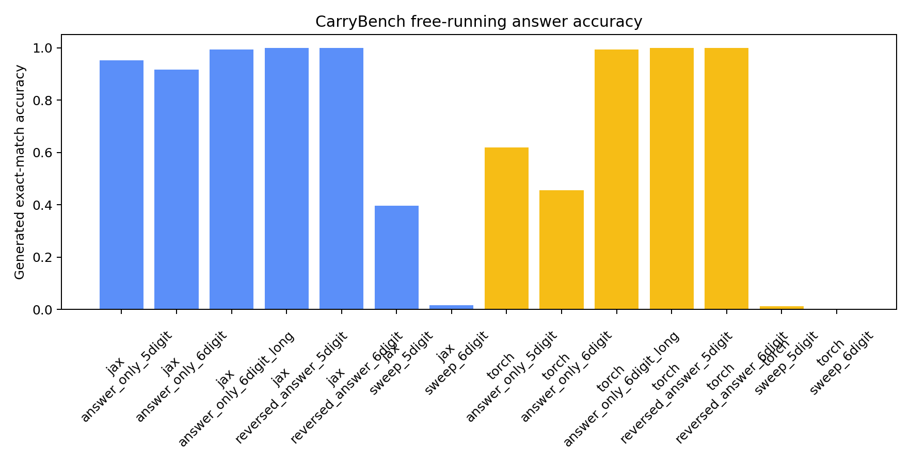
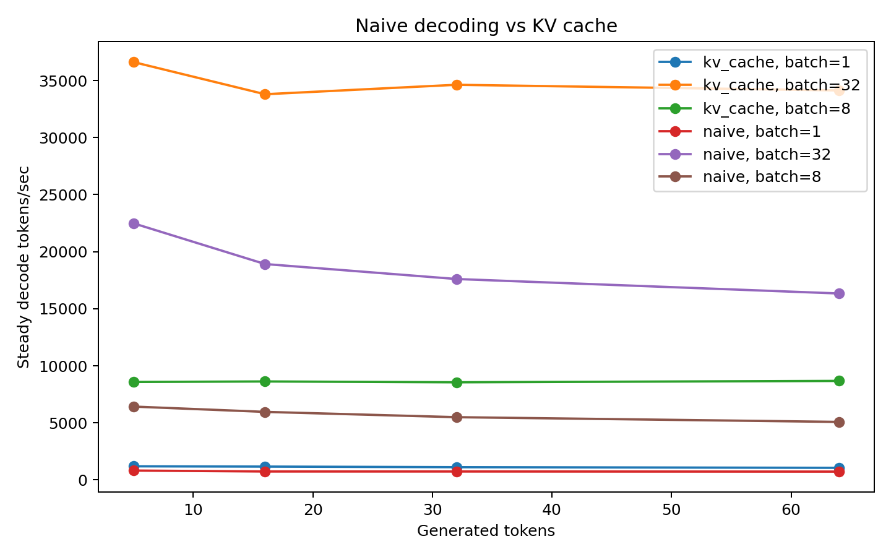
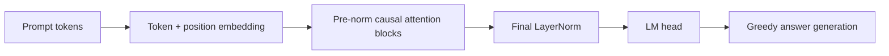

# CarryBench: Audited JAX vs PyTorch Transformer Benchmark

[](https://github.com/vishalvinjamuri27/CarryBench/actions/workflows/tests.yml)
[](https://colab.research.google.com/github/vishalvinjamuri27/CarryBench/blob/main/colab_run.ipynb)
[](LICENSE)

CarryBench is a controlled ML-systems study of matched decoder-only transformers implemented directly in JAX/Flax/Optax and PyTorch. Fixed-width addition provides deterministic data, short iteration cycles, interpretable failure modes, and an exact task-level metric.

## At a Glance

- **ML systems:** matched transformer implementations, JAX/XLA JIT, PyTorch SDPA and `torch.compile`, mixed precision, synchronized GPU timing, and KV-cache decoding.
- **Experimental design:** paired seeds, deterministic hash-disjoint splits, controlled ablations, free-running evaluation, bootstrap intervals, and explicit threats to validity.
- **Production habits:** typed configuration-driven CLIs, 36 tests across Python 3.10–3.12, smoke-training CI, reproducible Colab execution, raw artifacts, and release provenance.
- **Headline result:** carry-aligned reversed answers achieved 100% generated exact match across both frameworks, both digit lengths, and all three seeds.

For a two-minute technical review, inspect the [JAX model](src/flax_model.py), [PyTorch model](src/torch_model.py), [KV-cache implementation](src/kv_cache_jax.py), [framework-parity tests](tests/test_framework_parity.py), and [artifact provenance](artifacts/final/README.md).

## Research Questions

The project tests two separate questions:

1. How do JAX and PyTorch runtime choices affect compile cost, training throughput, latency, and memory?
2. How do loss masking and carry-aligned answer order affect free-running algorithmic generalization?

## Results

The clearest result is algorithmic: emitting the answer least-significant digit first, aligned with carry propagation, reached **100% free-running exact match** for both frameworks at 5 and 6 digits. Normal-order answer-only training was strong in JAX but unstable in PyTorch at the same 1,000-step budget; a 3,000-step 6-digit run reached about 99.3% in both frameworks. Full-sequence language-model loss was substantially worse.

### Generalization quality

Values are mean ± sample standard deviation across seeds 0, 1, and 2 on the hash-partitioned, disjoint test set. The metric greedily generates the complete answer; no ground-truth answer tokens are supplied during decoding.

| Experiment (1,000 steps) | JAX test exact match | PyTorch test exact match |
|---|---:|---:|
| 5-digit full-sequence LM | 34.35% ± 50.10% | 1.07% ± 0.51% |
| 6-digit full-sequence LM | 2.73% ± 4.69% | 0.12% ± 0.13% |
| 5-digit answer-only | 94.95% ± 0.75% | 74.33% ± 32.51% |
| 6-digit answer-only | 91.72% ± 0.88% | 52.48% ± 47.53% |
| 5-digit reversed answer | **100.00% ± 0.00%** | **100.00% ± 0.00%** |
| 6-digit reversed answer | **100.00% ± 0.00%** | **100.00% ± 0.00%** |

The large standard deviations are part of the result, not noise to hide: three seeds are enough to expose brittle optimization but not to estimate it precisely. The single-seed 3,000-step 6-digit answer-only runs reached 99.25% (JAX) and 99.30% (PyTorch); they demonstrate convergence with more compute but are not multi-seed estimates.



### Training runtime

These are synchronized measurements for the dedicated 4.75M-parameter, batch-256, sequence-length-13 runtime workload. Throughput comparisons are within this fixed shape and software environment, not universal framework rankings.

| Backend | Precision | First step (s) | Median ms/step | p95 ms/step | Tokens/s | Peak device memory |
|---|---|---:|---:|---:|---:|---:|
| JAX JIT | FP32 | 19.08 | **7.25** | **8.11** | **451,464** | 547 MB |
| JAX JIT | BF16 | 18.72 | 12.08 | 13.22 | 272,828 | 409 MB |
| PyTorch eager/manual attention | FP32 | 0.38 | 16.51 | 18.06 | 199,229 | 450 MB |
| PyTorch eager/SDPA | FP32 | 0.38 | 12.60 | 13.76 | 260,764 | 443 MB |
| PyTorch compiled/SDPA | FP32 | 14.98 | 11.14 | 11.79 | 296,532 | 449 MB |
| PyTorch compiled/SDPA | BF16 | 16.06 | 12.04 | 13.27 | 268,388 | **307 MB** |

After warm-up, JAX FP32 delivered 1.52× the throughput of compiled PyTorch SDPA and 2.27× that of eager handwritten attention for this small workload, at the cost of a 19.08-second first-step compile. BF16 reduced reported memory but did not improve throughput here, consistent with this model being too small for a blanket mixed-precision speedup claim. Framework memory counters are not guaranteed to capture identical allocator semantics.

### KV-cache decoding

At batch 32 and 64 generated tokens, cached decoding reached 34,132 tokens/s versus 16,337 tokens/s for naive decoding—a 2.09× speedup. The advantage increased with longer and larger-batch decoding; the full sweep covers batches 1, 8, and 32 and lengths 5, 16, 32, and 64.



The compact publication artifacts—aggregate CSVs, plots, and provenance—are committed under [`artifacts/final/`](artifacts/final/). The Colab workflow regenerates the complete raw bundle when a full audit is needed.

## What Is Implemented

- Matched decoder-only transformer implementations without Hugging Face dependencies.
- Exact GELU and matched LayerNorm epsilon across frameworks.
- Deterministic, disjoint train/validation/test partitions.
- Free-running greedy exact match for JAX and PyTorch.
- Teacher-forced accuracy retained under an explicit diagnostic name.
- Full-sequence, answer-only, and reversed-answer ablations.
- JAX JIT training and PyTorch eager, SDPA, and `torch.compile` baselines.
- Synchronized timing distributions: mean, median, p95, and standard deviation.
- Manual JAX KV-cache decoding validated against naive decoding.
- KV-cache sweeps over batch size and generated length.
- Carry-heavy diagnostic sets and curriculum evaluation slices.
- Raw JSON, CSV, Markdown, environment, Git revision, and plot generation.
- CPU unit tests, smoke training, linting, formatting, and multi-version CI.

## Primary Metrics

| Metric | Purpose |
|---|---|
| Generated exact match | Primary quality metric; greedily decodes the entire answer from the prompt |
| Teacher-forced exact match | Diagnostic next-token metric; not treated as task success |
| Carry-heavy generated exact match | Stress test for long carry behavior |
| Steady train-step time | Synchronized post-warm-up forward/backward/update latency |
| Tokens/sec | Training throughput for the measured batch and sequence shape |
| First-step time | Compile or framework warm-up cost |
| Median/p95/std | Timing stability rather than a single average |
| KV decode tokens/sec | Naive and cached autoregressive decode throughput |

Time-to-90% and time-to-99% summaries also use generated exact match.

## Experimental Controls

- A stable 64-bit hash assigns train/eval/test pairs to disjoint 80/10/10 partitions without creating contiguous operand bands.
- JAX and PyTorch receive the same examples, batch order, architecture shape, optimizer family, learning rate, and step budget.
- Evaluation retains partial final batches and weights metrics by example count.
- PyTorch host transfers and reporting metrics occur outside the timed train-step region.
- Runtime results record Python, framework, platform, and Git-commit metadata.
- JAX/XLA versus PyTorch eager is never treated as the only framework comparison; SDPA and compiled PyTorch results are generated alongside it.

See [Benchmark Protocol](docs/BENCHMARK_PROTOCOL.md) and [Limitations](docs/LIMITATIONS.md).

## Architecture

Both implementations use token and learned positional embeddings, pre-norm causal self-attention blocks, exact GELU MLPs, a final LayerNorm, and an untied language-model head.



For `n`-digit operands, examples use a fixed `n + 1` digit answer:

```text
<bos>007+008=0015<eos>
```

The reversed-answer ablation emits least-significant digits first so generation follows carry propagation:

```text
12345+67890=532080
```

Here `532080` is the reverse of the normal fixed-width answer `080235`.

## Local Setup

```bash
git clone https://github.com/vishalvinjamuri27/CarryBench.git
cd CarryBench
python3 -m venv .venv
source .venv/bin/activate
pip install -r requirements.txt
```

For the exact locally verified CPU package set:

```bash
pip install -r requirements-lock-cpu.txt
```

Run tests and smoke training:

```bash
python -m unittest discover -s tests
ruff check src tests
ruff format --check src tests
./scripts/run_smoke.sh
```

The smoke path is intentionally small enough for a CPU code review. Full published measurements require a CUDA GPU and use the Colab workflow below.

## Reproduce the GPU Study

Open [colab_run.ipynb](colab_run.ipynb), select a CUDA GPU, verify that both frameworks detect it, and run all cells. The main command is:

```bash
./scripts/run_final_experiments.sh
```

It runs the multi-seed quality suite plus these runtime variants:

- JAX JIT.
- PyTorch handwritten eager attention.
- PyTorch eager SDPA.
- PyTorch compiled SDPA.
- JAX naive and KV-cached decoding across multiple batch and decode lengths.

The default remains three seeds for Colab cost. For stronger accuracy estimates, run at least five:

```bash
SEEDS="0 1 2 3 4" ./scripts/run_final_experiments.sh
```

Then create the reviewable release bundle:

```bash
./scripts/export_release_artifacts.sh
```

Generated files include raw JSON, per-run tables, aggregate means and standard deviations, bootstrap intervals for generated accuracy, environment metadata, and SVG/PNG plots. The repository keeps only compact CSV summaries and PNG plots in `artifacts/final/`; the complete local bundle remains available for independent audit. Checkpoints remain ignored.

The Colab notebook also creates `results_bundle.zip` containing both `results/` and `artifacts/` for independent audit or a future rerun.

## Repository Layout

```text
artifacts/final/          Compact final CSV tables, PNG plots, and provenance
configs/                  Experiment definitions
docs/                     Protocol and limitations
scripts/                  Smoke, final-suite, and artifact-export runners
src/
  data.py                 Disjoint synthetic datasets and diagnostic slices
  flax_model.py           JAX/Flax transformer
  torch_model.py          PyTorch transformer with manual/SDPA attention
  train_jax.py            Jitted training and generated evaluation
  train_torch.py          Eager/compiled training and generated evaluation
  kv_cache_jax.py         Manual JAX KV-cache inference
  benchmark.py            Runtime and decode benchmark CLI
  summarize_results.py    Per-run and aggregate result summaries
  plot_results.py         Accuracy and KV-cache plots
tests/                    Unit, integration, split, generation, and SDPA tests
colab_run.ipynb           GPU experiment runner and artifact bundler
```

## Current Verification

The code and published artifacts were verified with:

- 36 passing tests.
- JAX smoke training end to end.
- PyTorch smoke training end to end.
- JAX naive/KV-cache output equivalence.
- PyTorch manual-attention/SDPA numerical equivalence.
- Ruff lint and format checks.
- Integrity checks that every published quality run uses the corrected hash split and records generated test predictions.

## License

MIT. See [LICENSE](LICENSE).
